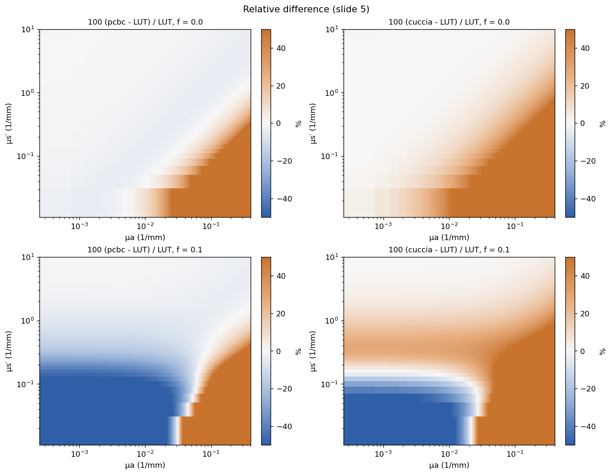
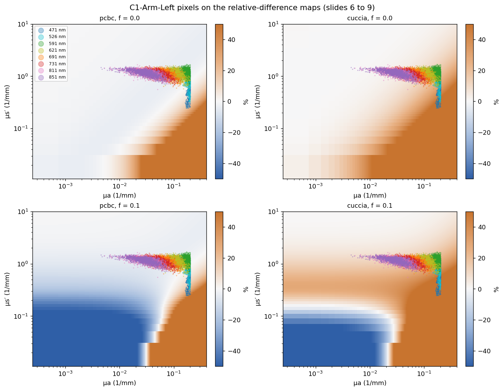
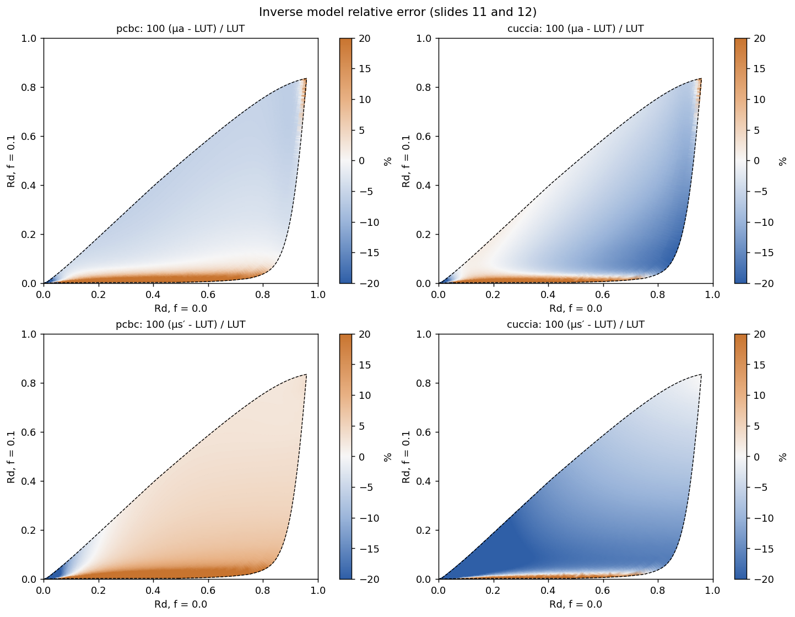
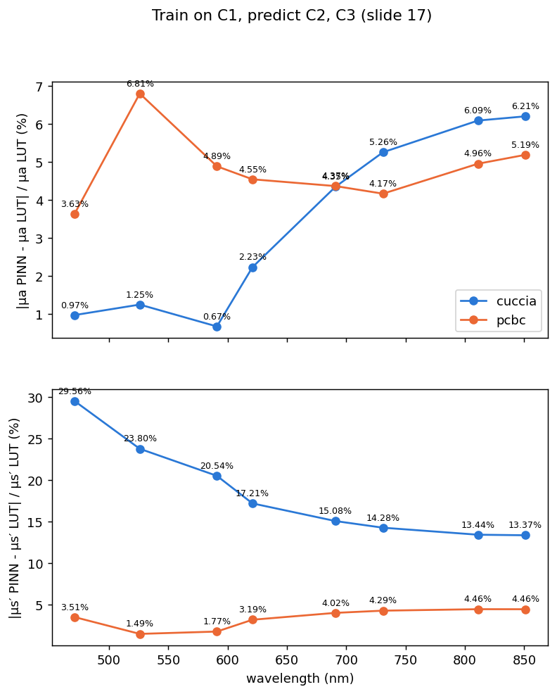
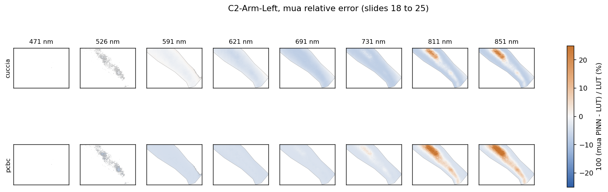

# SFDI Research

A research kit for **Spatial Frequency Domain Imaging (SFDI)** that reconstructs
tissue optical properties (absorption μₐ and reduced scattering μₛ′) from diffuse
reflectance, and trains a **Physics-Informed Neural Network (PINN)** to do the
inversion more accurately than the classical analytic models.

It reproduces the Tian Lab PINN study one step at a time. `config.yaml` runs on the
lab's real data and Monte Carlo LUT; `config.synthetic.yaml` runs the same steps on
synthetic stand-in data with a stand-in LUT, for testing without the lab's files.

## What it does

SFDI projects patterned light at several spatial frequencies onto tissue and
measures the diffuse reflectance `Rd`. From that reflectance you can recover the
optical properties, but the standard closed-form models are only approximate. This
project:

1. **Benchmarks the forward models** — compares the Cuccia diffusion approximation
   and the PCBC (Post convention) model against a Monte Carlo look-up table (LUT).
2. **Benchmarks the inverse** — recovers μₐ / μₛ′ from `Rd` and measures the error
   in the `(Rd@f=0, Rd@f=0.1)` plane.
3. **Trains a PINN** — an MLP that maps reflectance to optical properties, trained
   on one subject and graded on held-out subjects per wavelength.
4. **Runs ablations** — over wavelength, anatomical site, subject, and forward model.

## Setup

```
pip install -r requirements.txt
```

Requires Python 3, with NumPy, SciPy, PyTorch, Matplotlib, pandas, PyYAML, and
tifffile (plus `roifile` if your masks are ImageJ `.roi` files).

## Run order

Each script writes to `results_dir` from the active config: `results/real/` for
`config.yaml` (real data) and `results/synthetic/` for `config.synthetic.yaml`. Steps run in order; steps `00` are only needed
when you don't yet have the lab's real LUT and data.

| Step | Script | Output |
|---|---|---|
| 0 | `scripts/00_build_standin_lut.py` | stand-in Monte Carlo LUT (skip with the lab LUT) |
| 0 | `scripts/00_make_synthetic_data.py` | fake C1–C3 subjects in the lab's file format (skip with real data) |
| check | `scripts/check_setup.py` | checks paths, shapes, frequency order, ROI and LUT coverage. Run after every config change |
| 1 | `scripts/01_forward_error.py` | Cuccia and PCBC vs LUT maps, per-pixel tables |
| 2 | `scripts/02_inverse_error.py` | inverse maps in the `(Rd f=0, Rd f=0.1)` plane, tables |
| 3 | `scripts/03_train_pinn.py` | PINN trained on C1, graded on C2/C3 per wavelength, error maps |
| 4 | `scripts/04_ablation.py` | wavelength, site, subject and forward-model ablations |

Add `--quick` to steps 3 and 4 for a fast smoke test (a few hundred steps). Full
settings are 10,000 steps at batch 32,768 — roughly 20 minutes per run on a 2-core
CPU, much faster on a GPU.

`example_results/` holds a snapshot of every script's output on the real data (the lab's
LUT and the human subjects). It was made before C3's clamped μₐ values were excluded
(`ref_caps: auto`), so its 471/526 nm errors are inflated, and its `04_*` ablations
come from a `--quick` run. Fresh outputs go to `results/real/` (real) and
`results/synthetic/` (synthetic); neither folder is tracked by git.

## Switching to real data

Change only `config.yaml`, then run `python scripts/check_setup.py` until it says "All checks passed".

Edit `config.yaml` (fields that only the project lead can supply are marked `ASK PL`):

1. **Rd files** — set `data_root` and `file_pattern`. Hyperstacks are ImageJ files
   named like `R-Arm-Left-WithoutCorrection.tif`: 8 wavelengths × 8 spatial
   frequencies, 1392×1040, 32-bit.
2. **Frequencies** — fill `stack_freqs` with the real Z-slice frequencies. Inspect a
   file with `python -c "from sfdi.data import hyperstack_labels as h; print(h('path/to/file.tif'))"`.
3. **LUT** — set `lut_path`, `lut_format: mat`, and `lut_mat_keys` to the variable
   names in their `.mat` file; `Rd_axes` describes the array ordering.
4. **Masks** — ROI polygons from ImageJ (`.roi`), or PNG/NPY masks. Set `mask_pattern`.
5. **Supplied optical properties** — the per-pixel μₐ, μₛ′ maps. Set `ref_pattern`.
   Expected: `.npz` or `.mat` with arrays `mua` and `musp`, each shaped (8 wavelengths, 1040, 1392).
   If their maps are TIFFs, convert once:
   `np.savez("OP-Arm-Left.npz", mua=tifffile.imread("mua.tif"), musp=tifffile.imread("musp.tif"))`.
   If the file is missing, the LUT inverse of `Rd` is used instead (the checker says which).
6. **Forward model** — set `forward.n`, and put the calibrated boundary parameter B
   in `A_value` with `A_source: value`.

## Real data ingestion

`config.yaml` now points at the lab's real files (`data_root: ~/Downloads/SFDIDATA`,
one folder per subject+site, e.g. `C1-Arm/R-Arm-Left-WithoutCorrection.tif`). The
raw hyperstacks are ~450 MB per cell (R + M), too slow to re-read every script run,
so a one-time ingestion step crops and caches each cell as a small `.npz` under
`processed_root` (`data/processed`):

```
python scripts/ingest_data.py        # builds/updates data/processed, ~4s for 20 cells
python scripts/check_setup.py        # verify paths, shapes, ROI, frequency order
```

`scripts/ingest_data.py` is incremental: it only re-ingests a cell whose source
files or pipeline settings (`use_freqs`, `wavelengths`, `stack_freqs`, `ref_caps`)
changed since the last run; `--force` re-ingests everything. It also catches
accidental duplicate folders (e.g. `P1-Arm 2` next to `P1-Arm`) and reports them.
`sfdi/data.py`'s `Cell` loads the cached `.npz` automatically whenever
`processed_root` is set and a matching cache exists, and falls back to the raw
TIFFs otherwise. If the cache was built under different ingest settings
(`use_freqs`, `wavelengths`, `stack_freqs`, `ref_caps`) it raises rather than
silently using stale data. `Cell` does **not** check source-file mtimes, so after
editing or replacing any raw TIFF, rerun `scripts/ingest_data.py`.

The lab's supplied μₐ is a LUT inversion that gets capped at exactly the LUT bound
(`ref_caps: {mua: 0.2}`) on many 471 nm pixels, and has outright NaNs elsewhere;
both are excluded from `Cell.valid()`, not treated as real readings.

The lab's Monte Carlo LUT is `luts/LUT_g0p9_0_0.1.mat` (g = 0.9, Rd at f = 0 and
0.1 mm⁻¹). It is a MATLAB struct (`LUT.Mua`, `LUT.Musp` meshgrids, `LUT.M1`/`LUT.M2`
= Rd per frequency) and the frequencies are not stored in it, so `lut_mat_keys`
in `config.yaml` names them. Inverting the lab's Rd through it reproduces their
supplied μₐ/μₛ′ maps to ~0.01%, which confirms it is the LUT they used.

Useful overrides:
- `SFDI_CONFIG=path/to/config.yaml` — use a different config without `--config` on every script.
- `SFDI_DATA_ROOT=/path/to/data` — override `data_root` without editing the yaml.
- `config.synthetic.yaml` — the original synthetic-data config, unchanged, for a quick
  end-to-end smoke test with no lab files: `SFDI_CONFIG=config.synthetic.yaml python scripts/check_setup.py`.

## Results on real data

The figures below were made on the lab's data with the lab's LUT (`luts/LUT_g0p9_0_0.1.mat`),
using the forward-model settings in `config.yaml` (n = 1.4, Fresnel A, not yet the calibrated B).
Full outputs are in `results/real/` after a run; these copies are in `docs/real_results/`.

### Forward models vs the LUT (step 1)

Relative difference of Cuccia and PCBC from the Monte Carlo LUT across the whole (μₐ, μₛ′)
grid. PCBC stays within a few percent over most of the region where tissue lies; Cuccia is
off by 10 to 20% at f = 0.1.



The same maps with C1-Arm-Left's pixels on top. The vertical stripe of 471/526 nm pixels at
μₐ = 0.2 is the lab's LUT inversion hitting its cap; those pixels are excluded from grading
(`ref_caps` in `config.yaml`).



Mean absolute relative difference over C1-Arm-Left (all wavelengths, %):

| Model | Rd f = 0 | Rd f = 0.1 |
|---|---|---|
| Cuccia | 7.97 | 17.61 |
| PCBC | 3.19 | 3.96 |

### Inverse error (step 2)

Error in recovered μₐ and μₛ′ across the LUT's (Rd f = 0, Rd f = 0.1) domain. On C1-Arm-Left,
Cuccia gets μₐ to 3.0% but μₛ′ only to 17.8%; PCBC gets 4.3% and 3.3%.



### PINN, trained on C1 and graded on C2 and C3 (step 3, full 10,000 steps)



| Wavelength (nm) | 471 | 526 | 591 | 621 | 691 | 731 | 811 | 851 |
|---|---|---|---|---|---|---|---|---|
| PCBC μₐ error % | 59.2 | 33.4 | 5.6 | 4.5 | 4.4 | 4.2 | 5.0 | 5.2 |
| PCBC μₛ′ error % | 23.3 | 12.2 | 2.1 | 3.2 | 4.0 | 4.3 | 4.5 | 4.5 |
| Cuccia μₐ error % | 68.1 | 40.5 | 2.8 | 2.2 | 4.4 | 5.3 | 6.1 | 6.2 |
| Cuccia μₛ′ error % | 12.5 | 17.0 | 20.8 | 17.2 | 15.1 | 14.3 | 13.4 | 13.4 |

Per-pixel μₐ error on the held-out C2-Arm-Left. 471 nm is empty and 526 nm is sparse because
almost every pixel there was capped in the lab's reference map.



**Read the 471 and 526 nm numbers with care.** C3's reference μₐ is capped at 0.1955 rather
than 0.2, so `ref_caps: {mua: 0.2}` does not catch it, and those capped values are still being
graded. Inverting C3's Rd through the LUT disagrees with its supplied μₐ by 50 to 97% at
471/526 nm, against under 0.5% at 621 and 811 nm. Those two columns will change once C3's cap
is handled. Even before that, only ~2% (471 nm) and ~20% (526 nm) of ROI pixels have a usable
reference value.

## Code map

| File | What it does |
|---|---|
| `sfdi/physics.py` | Cuccia and PCBC forward formulas (Post convention A), Fresnel A |
| `sfdi/lut.py` | LUT loading, forward interpolation, inverse lookup, LUT boundary |
| `sfdi/mc_lut.py` | White Monte Carlo used to build the stand-in LUT |
| `sfdi/data.py` | Hyperstack, mask and supplied-property loading; one "cell" per subject/site/side |
| `sfdi/ingest.py` | Builds the per-cell `.npz` cache from the lab's raw files (`scripts/ingest_data.py`) |
| `sfdi/pinn.py` | MLP, Huber-log and Log-MSE losses, training loop |
| `sfdi/experiment.py` | Selecting training cells and grading against the LUT |
| `config.yaml` | Every setting, with the unknowns marked `ASK PL` |

## Notes on reproducibility

With the lab's real data and LUT, the code successfully reproduces the reference study's findings:
1. **Forward model accuracy**: PCBC significantly outperforms Cuccia, particularly at shorter wavelengths (471 and 526 nm).
2. **PINN training**: As shown in the ablations below, training exclusively on the longer wavelengths (811/851 nm) noticeably improves the held-out $\mu_s^\prime$ error compared to training on all wavelengths.

```text
            run  model                                               train                     wavelengths  held_out_mua_%  held_out_musp_%
all_wavelengths   pcbc C2-Arm-Left,C2-Arm-Right,C2-Hand-Left,C2-Hand-Right 471,526,591,621,691,731,811,851            6.19             5.51
     wl_621_851   pcbc C2-Arm-Left,C2-Arm-Right,C2-Hand-Left,C2-Hand-Right             621,691,731,811,851            7.68             5.26
     wl_811_851   pcbc C2-Arm-Left,C2-Arm-Right,C2-Hand-Left,C2-Hand-Right                         811,851           12.56             4.97
         wl_811   pcbc C2-Arm-Left,C2-Arm-Right,C2-Hand-Left,C2-Hand-Right                             811           12.12             6.26
     wl_471_526   pcbc C2-Arm-Left,C2-Arm-Right,C2-Hand-Left,C2-Hand-Right                         471,526          234.75            51.18
    site_C2_arm   pcbc                            C2-Arm-Left,C2-Arm-Right 471,526,591,621,691,731,811,851            5.73             4.35
   site_C2_hand   pcbc                          C2-Hand-Left,C2-Hand-Right 471,526,591,621,691,731,811,851            7.10             6.15
     subject_C1   pcbc C1-Arm-Left,C1-Arm-Right,C1-Hand-Left,C1-Hand-Right 471,526,591,621,691,731,811,851           10.81             4.26
   model_cuccia cuccia C2-Arm-Left,C2-Arm-Right,C2-Hand-Left,C2-Hand-Right 471,526,591,621,691,731,811,851            6.13            16.32
```
